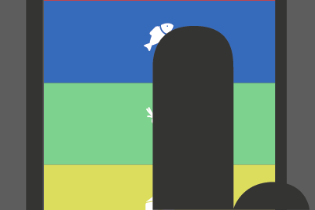
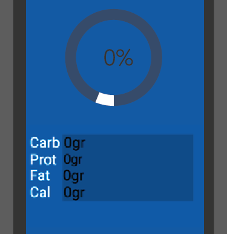
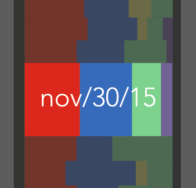
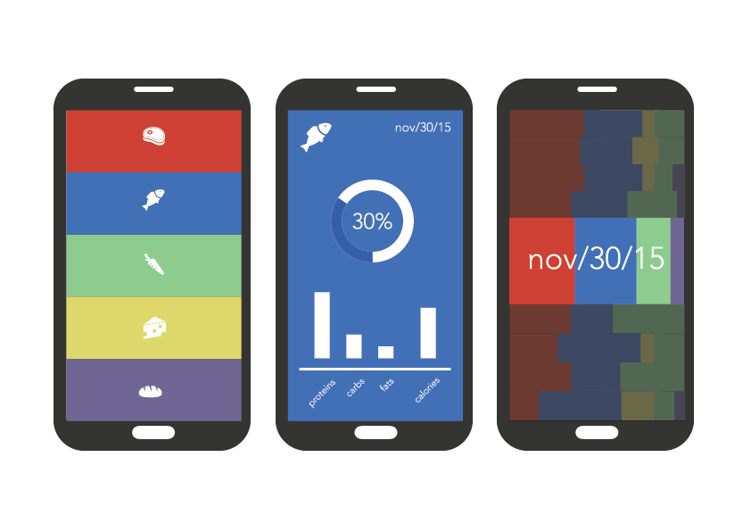
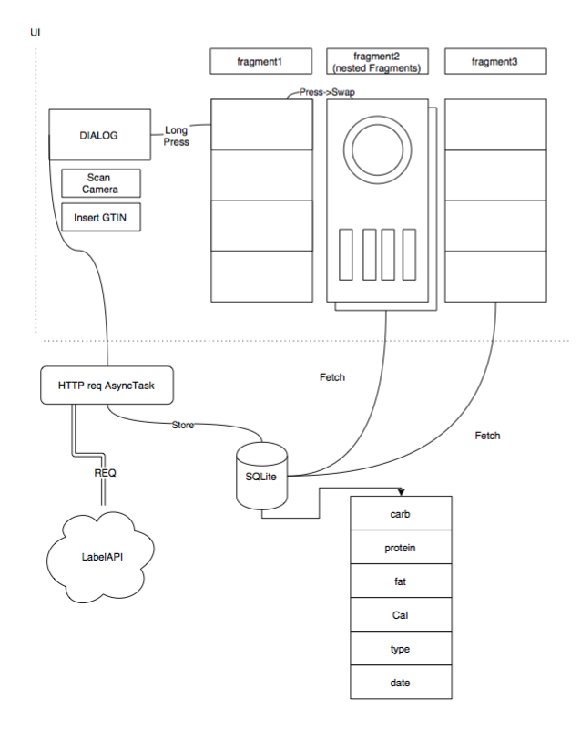
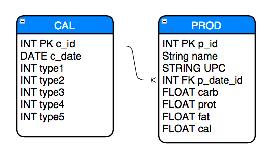
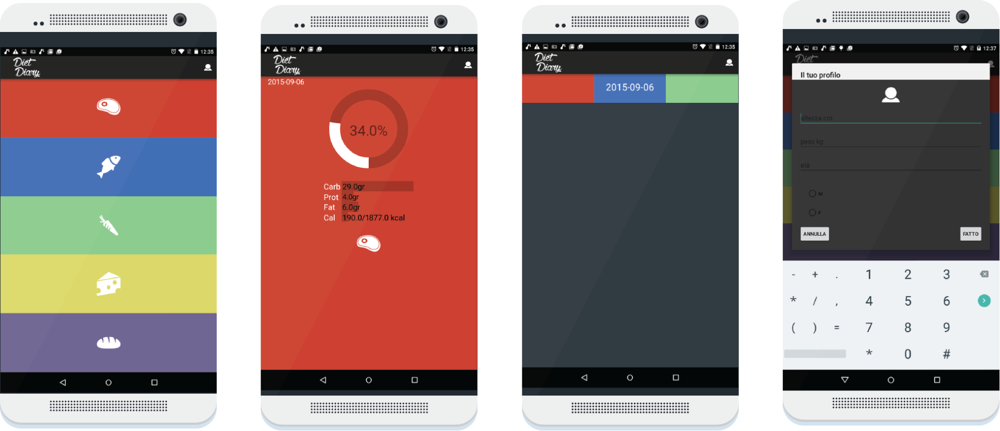
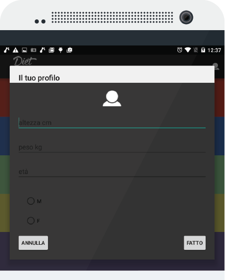

<html><head><meta content="text/html; charset=UTF-8" http-equiv="content-type"></head><body class="c11">
Sviluppo Applicazioni Mobili

prof: Vincenzo Gervasi

Relazione Progetto

candidato: Mario Viti 

matr: 496105
<h1 class="c0 c4" id="h.chx7g45bicwm"></h1><h1 class="c0 c4" id="h.n0raxpwtmkjc"></h1><h1 class="c0 c4" id="h.uzyr8a6xtuwj"></h1><h1 class="c0 c4" id="h.d2ufxi6jcj0z"></h1><h1 class="c0" id="h.4f9hxn449g5e">Assistente alimentare.</h1>

<h2 class="c0" id="h.3g997ap7tq4p">Cos&rsquo;&egrave; Diet Diary?</h2>

DietDiary &egrave; un&rsquo;applicazione Android grazie alla quale &egrave; possibile tenere sotto controllo la propria dieta. Grazie alla visualizzazione intuitiva e ai sommari, &egrave; possibile, a colpo d&rsquo;occhio ed in pochi attimi, avere un resoconto della dieta seguita nei giorni, nelle settimane o nei mesi precedenti. La catalogazione semplificata rende l&rsquo;applicazione di semplice utilizzo, grazie anche ad un&rsquo;interfaccia minimale. Per mezzo di questo strumento, per esempio, l&#39;utente potr&agrave; riscontrare o meno la costanza con la quale ha seguito una determinata igiene alimentare o semplicemente potr&agrave; monitorare un graduale processo di variazione &nbsp;nell&#39;assunzione degli alimenti nel tempo, in base alla categoria, cos&igrave; da poter adottare una dieta pi&ugrave; equibrata.

<h2 class="c0" id="h.5su7vbshemiw">Come si usa?</h2>

Inserire un alimento nella dieta &egrave; semplice: l&rsquo;applicazione &egrave; completa di scanner di codice a barre e baster&agrave; quindi scansionare un prodotto per ottenere le relative informazioni nutrizionali, come l&#39;apporto calorico o l&#39;ammontare di categorie nutrizionali come carboidrati, grassi, vitamine, ecc. Una volta inserito il prodotto entrer&agrave; a fare parte dei sommari giornalieri che potranno essere visualizzati nei menu di &quot;Sommario&quot; e &quot;Calendario&quot;.
<h2 class="c0" id="h.bwfdy05279y7"></h2><h2 class="c0" id="h.v601y3o2ncbc">Sommario.</h2>

Il menu &quot;Sommario&quot; offre le statistiche alimentari giornaliere relative ad una categoria. Ci sono 5 categorie che riassumono le principali categorie alimentari, ognuna di queste &egrave; color coded.

Per ogni categoria verr&agrave; tenuta traccia dei principali nutritivi e della loro distribuzione, l&rsquo;indicatore circolare indicher&agrave; in percentuale quanti alimenti di una determinata categoria alimentare sono presenti nella dieta giornaliera.

<h2 class="c0" id="h.8x1f2yyvhcml">Calendario.</h2>

La terza schermata &egrave; costituita dal menu &ldquo;Calendario&rdquo;.

Questo menu offre una visualizzazione di come gli alimenti sono presenti nelle varie categorie e quindi della loro distribuzione giorno per giorno. Grazie alla categorizzazione color coded &egrave; possibile comprendere in maniera intuitiva se una diet&agrave; &egrave; stata bilanciata nel tempo.

<h1 class="c0 c4" id="h.fyn42grf0yym"></h1><h1 class="c0" id="h.cozz339vdu5z">Sviluppo</h1><h2 class="c0 c3" id="h.pukwj2regmel"></h2><h2 class="c0" id="h.vf6abf2sv8z7"></h2><h2 class="c0" id="h.ucm0j747y6rq">Progettazione Interfaccia</h2>

Lo sviluppo dell&#39;applicazione nasce dall&rsquo;idea di interfaccia base prototipo, che &egrave; stata poi mantenuta.

La maggior parte degli elementi &egrave; custom, dato che l&rsquo;interfaccia non adotta nessun canone se non quello personale di Design. L&rsquo;applicazione si sviluppa attorno ad una activity singola che deferisce/diffrenzia poi la gestione dei layout ai fragments annidati.

Data la linearit&agrave; dell&rsquo;interfaccia, alla quale si deve una certa semplicit&agrave; di navigazione, sono stati aggiunti effetti dinamici e animazioni che accompagnino le azioni dell&rsquo;utente. Questi feedback animati rendono un design altrimenti piatto, &nbsp;interattivo e visivamente pi&ugrave; concreto.

<h2 class="c0" id="h.wgw2atp8qy6b">Navigazione</h2>

La navigazione avviene all&rsquo;interno di una singola Activity. Il livello pi&ugrave; superficiale comprende 3 menu/pagina dal quale accedere ai bottoni per inserimento alimenti (MENU_FRAGMENT), la pagina calendario scorrevole fino alla pagina per la visualizzazione dei sommari (ROOT_FRAGMENT). Quest&rsquo;ultimo ha annidate 5 differenti istanze di menu pagina, ogniuna di esse &egrave; rappresentativa di una categoria, la categoria visibile &egrave; selezionabile mediante bottone nel MENU_FRAGMENT.
<h1 class="c0 c4" id="h.dyate6woi9e7"></h1><h1 class="c0 c4" id="h.nj79m6ojjc2d"></h1><h1 class="c0" id="h.pazwq52v1fbm">Componenti</h1>

L&rsquo;applicazione comprende vari componenti: le custom View che andranno a implementare l&rsquo;interfaccia prototipo; un client Http per la connessione ai servizi che distribuiscono le informazioni nutrizionali relative agli alimenti; un database embedded SQLite per la gestine e la permanenza dei dati ed infine, un&#39;applicazione per la scansione del codice a barre.

<h3 class="c0" id="h.pzye6f3467tu">Custom View</h3>

Le custom view fanno parte dell Layout dell&#39;applicazione e sono dotati di animazioni 

dedicate. <a href="#ftnt1" id="ftnt_ref1">[1]</a>
<h3 class="c0" id="h.6hxk20g3ix0b">Client Http</h3>

L&rsquo;applicazione &egrave; registrata presso un Service che fornisce una RestFullAPI per la distribuzione di infromazioni nutrizionali <a class="c10" href="https://www.google.com/url?q=http://developer.foodessentials.com/&amp;sa=D&amp;ust=1480242990181000&amp;usg=AFQjCNFNILbDHiBqJKlZc2zalCS5ITSW1g">http://developer.foodessentials.com/</a>

Il client Http viene eseguito in un thread a parte e fornisce un wrapper per la connessione ai vari metodi messi a disposizione dal sopracitato servizio.

<h3 class="c0" id="h.eylrzsmytnw8">Database SQLite</h3>

Pratica standard nello sviluppo delle applicazioni &egrave; appoggiarsi al database interno gestito dal SO Android hosted sul deveice dell&rsquo;user. Strutturalmente il database &egrave; molto semplice, anche se &egrave; stata effettuata la scelta di denormalizzare i dati per semplificare la logica e le performance delle queries dato che il tread off con lo spazio occupato risulta accettabile (5 interi in pi&ugrave; per record giornaliero, ottimizzati dal sistema di tipi dinamici di SQLite).
<h3 class="c0" id="h.7wm2d89wlq87">Scansione BarCode</h3>

Lo scan di bar code &egrave; implementato tramite intent lanciato alla applicazione per scanner di Bar code Zebra Crossing <a class="c10" href="https://www.google.com/url?q=https://github.com/zxing/zxing&amp;sa=D&amp;ust=1480242990183000&amp;usg=AFQjCNEYn6j0X8QhFPGb_OemIBmslnYXtg">https://github.com/zxing/zxing</a>
<h1 class="c0 c4" id="h.ywnszdj8ykqo"></h1><h1 class="c0 c4" id="h.5y464vs1b9gv"></h1><h1 class="c0" id="h.pxjg1vgt3zzy">Versione di Release.</h1>

<h3 class="c0 c3" id="h.48ione4se0dt"></h3><h3 class="c0" id="h.aunrxoj202cd">L&rsquo;aggiunta della actionBar. </h3>

Per rafforzare l&rsquo;identit&agrave; dell&rsquo;applicazione &egrave; stata aggiunta una actionBar comprensiva di logo definitivo. Allo stesso tempo l&rsquo;aggiunta di una actionBar fa rientrare nel canone Android &nbsp;il design dell Applicazione.

<h2 class="c0" id="h.o51ggco66jmq">BMR</h2>

L&rsquo;applicazione &egrave; stata fornita di un form per l&rsquo;aggiunta delle informazioni personali.

Da queste viene calcolato il Fabbisogno Energetico Basale o BMR secondo l&rsquo;algoritmo di Harrison &amp; Benedict.

<a href="#ftnt_ref1" id="ftnt1">[1]</a>&nbsp;Per una visione approfondita consultare il Diagramma delle Classi.

</body></html>
